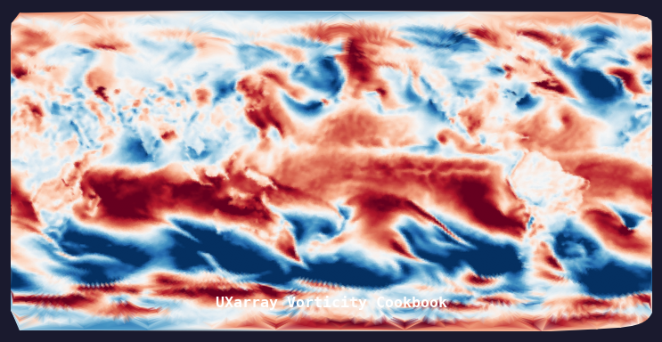

# UXarray Vorticity Cookbook



[](https://github.com/ProjectPythia/uxarray-vorticity-cookbook/actions/workflows/nightly-build.yaml)
[](https://binder.projectpythia.org/v2/gh/ProjectPythia/uxarray-vorticity-cookbook/main?labpath=notebooks)
[](https://zenodo.org/badge/latestdoi/475509405)

This Project Pythia Cookbook demonstrates how to use [UXarray](https://uxarray.readthedocs.io) to read an MPAS unstructured-grid NetCDF dataset, compute relative vorticity from the 10-meter zonal and meridional wind components, and visualize the results as shaded polygon plots on global and regional maps.

## Motivation

TEST CLAUDE
TEST CLAUDE

MPAS (Model for Prediction Across Scales) uses an unstructured Voronoi mesh that cannot be handled by conventional grid-aware tools. UXarray provides an xarray-compatible interface for unstructured grids, making it straightforward to load MPAS output, apply differential operators such as curl and divergence, and create publication-quality visualizations — all without interpolating to a regular lat/lon grid.

By the end of this cookbook you will know how to:

- Open an MPAS grid topology file and a diagnostic output file together with `ux.open_dataset`
- Select individual time steps from face-centered variables
- Compute relative vorticity (∂v/∂x − ∂u/∂y) with a single call to `UxDataArray.curl`
- Render the result as a shaded polygon plot with `plot.polygons`
- Extract a regional subdomain with `subset.bounding_box`

## Authors

[John Clyne](https://github.com/clyne)

### Contributors

<a href="https://github.com/ProjectPythia/uxarray-vorticity-cookbook/graphs/contributors">
  
</a>

## Structure

This cookbook contains a single notebook that walks through the full workflow from data loading to visualization.

### Vorticity from MPAS Data

The notebook covers:

1. **Loading the dataset** — opening a 40,962-cell MPAS-Atmosphere 120 km mesh with `ux.open_dataset`
2. **Extracting wind components** — selecting `u10` (zonal) and `v10` (meridional) 10-meter winds for a single time step
3. **Computing vorticity** — calling `u10.curl(v10)` to obtain the vertical component of relative vorticity
4. **Plotting** — global shaded polygon map, side-by-side comparison of u10/v10/vorticity, and a North Atlantic regional zoom

## Running the Notebooks

You can run the notebook using [Binder](https://binder.projectpythia.org/) or on your local machine.

### Running on Binder

The simplest way to interact with a Jupyter Notebook is through
[Binder](https://binder.projectpythia.org/), which enables the execution of a
[Jupyter Book](https://jupyterbook.org) in the cloud. Simply navigate to
the top right corner of the book chapter you are viewing and click
on the rocket ship icon, then select "launch Binder". After a moment you
will be presented with a notebook you can interact with. Code cells
have no output until you execute them by pressing {kbd}`Shift`+{kbd}`Enter`.

### Running on Your Own Machine

1. Clone the repository:

   ```bash
   git clone https://github.com/ProjectPythia/uxarray-vorticity-cookbook.git
   ```

2. Move into the directory:

   ```bash
   cd uxarray-vorticity-cookbook
   ```

3. Create and activate the conda environment:

   ```bash
   conda env create -f environment.yml
   conda activate uxarray-vorticity-cookbook-dev
   ```

4. Start JupyterLab:

   ```bash
   cd notebooks/
   jupyter lab
   ```
